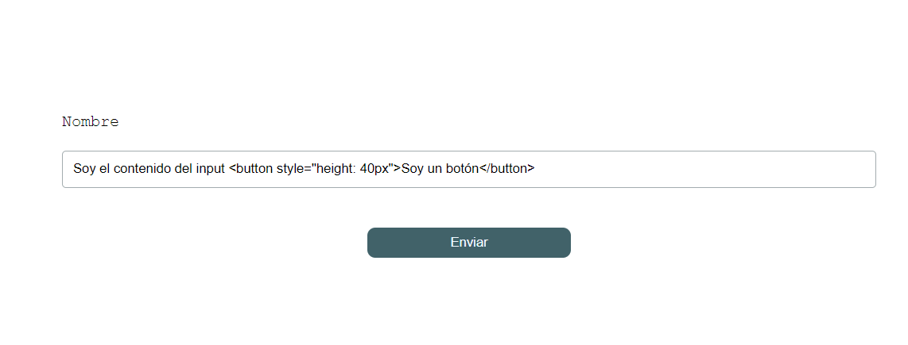
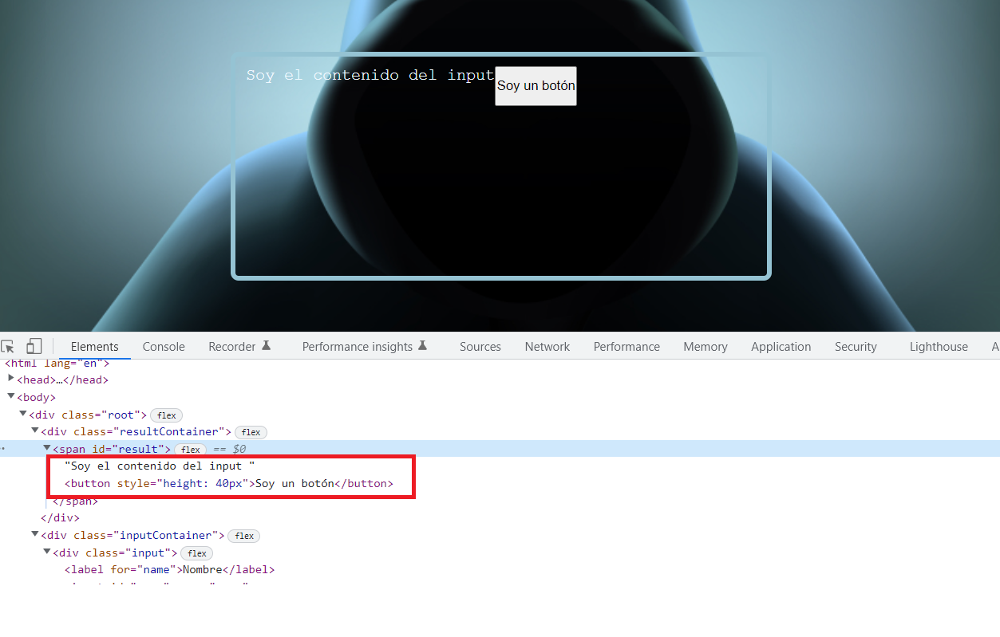
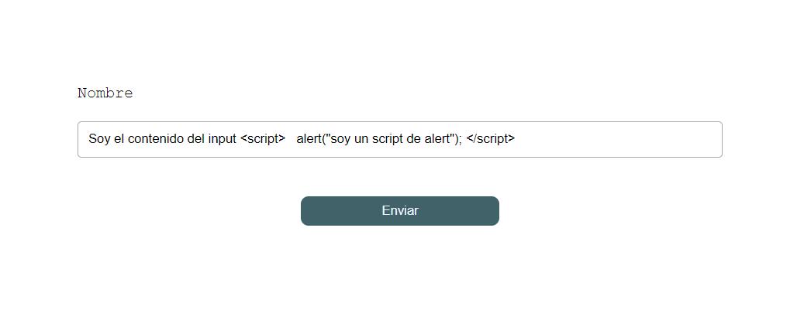

# XSS

## 01 no framework

En este ejemplo veremos como inyectar un **script** a un elemento **input** y ejecutar su código. La salida del **input** la mostraremos en una caja en nuestra página.

Vamos a comenzar añadiendo el siguiente código **html**:

```html
Soy el contenido del input <button>Soy un botón</button>
```

Como podemos observar la salida del **input** nos muestra el texto pero también un botón. Esto es porque el **DOM** ha podido leer esta etiqueta. Si inspecionamos el código en el navegador podemos ver que así es:



Esto nos puede llevar a pensar: Sí se ha podido pintar un botón, ¿Por qué no ejecutar un **script** utlizando sus etiquetas?... probemos el siguiente ejemplo:

```html
Soy el contenido del input
<script>
	alert("soy un script de alert");
</script>
```

Upss!! ¿Y mi alert?...



Podemos ver que se ha incluido el **script** pero no se ha ejecutado el **alert**.

Quizá sea demasiado obvio incluir una etiqueta `<script>` y el navegador no lo ejecuta por seguridad.

Lo que sucede es que **html5** ya controla este tipo de inyecciones de código en los **input** y no permite ejecutar su contenido por seguridad.

Una de las formas para saltarnos esta restricción es inyectar nuestro código por ejemplo en la función `onerror` de la etiqueta ``

``



[En este enlace puedes encontrar varios ejemplos de código con inyecciones **XSS**]("https://cheatsheetseries.owasp.org/cheatsheets/XSS_Filter_Evasion_Cheat_Sheet.html")

